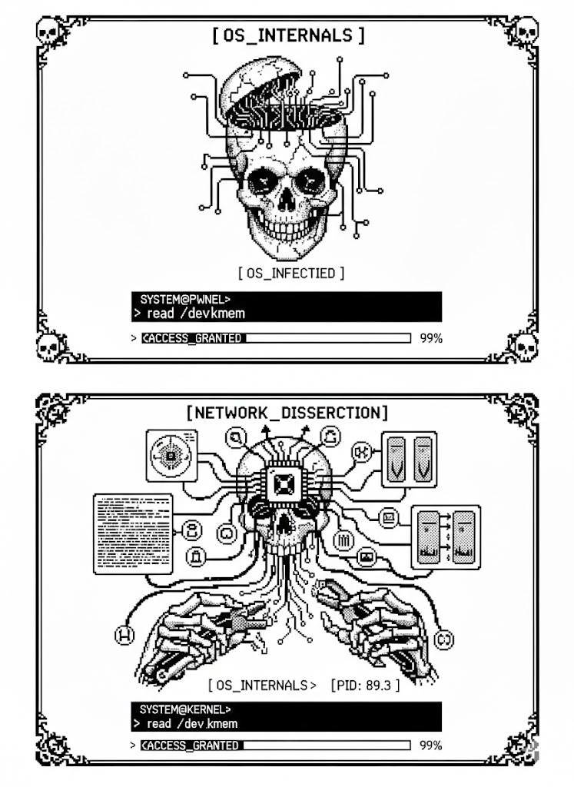

----------------------------------------------------------
[ RESEARCH PORTFOLIO  ]
----------------------------------------------------------
# SECURITY RESEARCH

## // CATEGORIES
* [MALWARE](./malware-list.md)
* [NETWORKING](./networking-list.md)
* [OS_INTERNALS](./os-list.md)

  # // CATEGORIES

  
   
  [ 0x01 // MALWARE_DISSECTION ]
     

  
   
  [ 0x02 // NETWORK_ANALYSIS ]
     

  
   
  [ 0x03 // OS_KERNEL_RESEARCH ]

